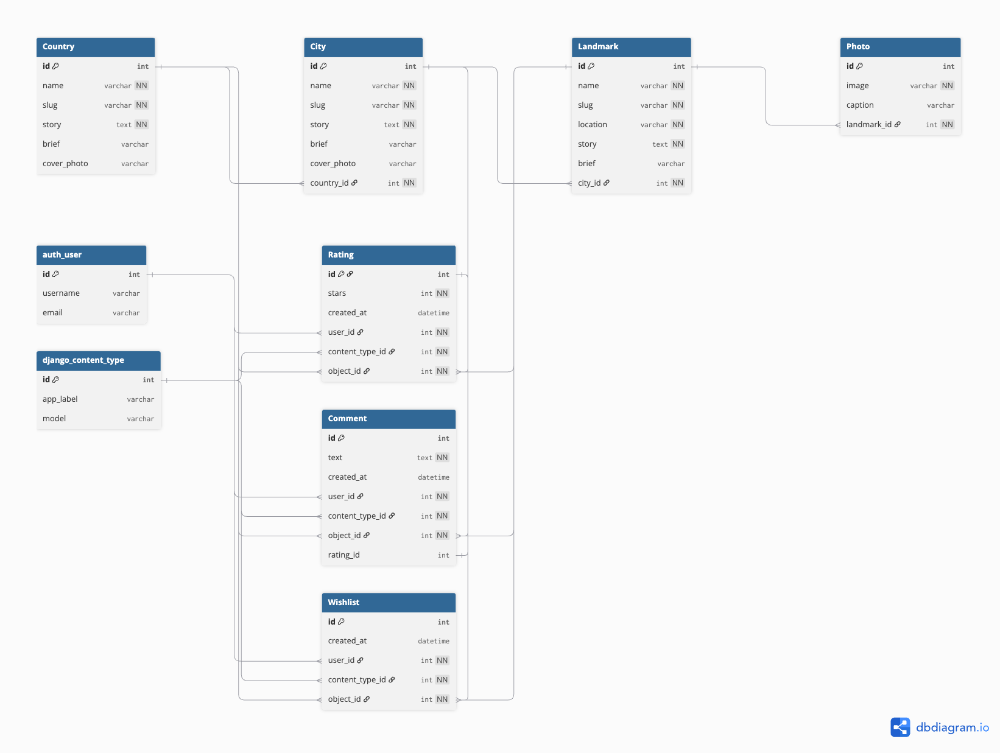

# Visit Me

Visit Me is a Django 5 web application that helps travellers discover and save the world’s most beautiful countries, cities, and landmarks. Authenticated users can rate destinations, write reviews, and add favourites to their wishlist. The app provides a guided discovery experience inspired by travel platforms such as TripAdvisor.

---

## Live Demo
- **Production:** [https://visitme-04442a94a758.herokuapp.com/](https://visitme-04442a94a758.herokuapp.com/)

---

## Features

### Guided Discovery Experience
- Hero carousel with search shortcuts and curated “Top Rated” lists.  
- Explore page for searching, filtering, and sorting destinations.  
- Clean storytelling layout for countries, cities, and landmarks.

### Wishlist with Instant Feedback
- Heart icons toggle favourites dynamically via AJAX without page reloads.  
- Handles both logged-in and anonymous users gracefully.

### Half-Star Ratings & Review Flow
- Interactive star widgets allow quick ratings directly from the hero banner.  
- Optional review modal appears after rating submission.  
- Logged-in users can update or delete their reviews.

### Account Management
- Django Allauth integration for registration, login, logout, and profile access.  
- Secure user authentication system with permission checks.
- All create, update, and delete actions for ratings, comments, and wishlists are protected by Django authentication and authorization checks.

### Responsive & Accessible Design
- Built with Bootstrap 5 and custom CSS.  
- Fully responsive layout and high contrast for accessibility.  

---

## Agile Methodology

This project was developed using **Agile methodology**.  
Planning and progress were managed using **GitHub Projects**, with work divided into **Epics**, **User Stories**, and **Tasks**.

### MoSCoW Prioritisation

| Priority | Features |
|--------|---------|
| Must Have | User authentication, browse destinations, ratings, reviews CRUD, wishlist |
| Should Have | Half-star ratings, edit reviews, responsive design |
| Could Have | User-submitted hidden gems |
| Won’t Have | Public admin CMS (future phase) |

---

## CRUD Functionality

| Model     | Create | Read | Update | Delete |
|----------|--------|------|--------|--------|
| Country  | Admin  | ✔    | Admin  | Admin  |
| City     | Admin  | ✔    | Admin  | Admin  |
| Landmark | Admin  | ✔    | Admin  | Admin  |
| Rating   | ✔ (User) | ✔ | ✔ | ✔ |
| Comment  | ✔ (User) | ✔ | ✔ | ✔ |
| Wishlist | ✔ (User) | ✔ | ❌ | ✔ |

**Note:** Wishlist items do not require update functionality; users may only add or remove items.

---

## User Stories & Acceptance Criteria

The project was planned and developed using **Agile methodology**.  
All core features were defined through user stories, each with clear acceptance criteria to ensure the functionality met user needs and project requirements.

---

### User Story 1: Home Page & Navigation
**As a visitor**, I can access a welcoming home page so that I understand what the application is about and how to get started.

**Acceptance Criteria**
- The home page displays a short introduction and tagline explaining the purpose of the application.
- The navigation bar includes links to Home, Discoveries, and Login/Register.
- The layout is responsive and functions correctly on desktop, tablet, and mobile devices.

---

### User Story 2: Country and City Browsing
**As a visitor**, I can browse countries and cities so that I can explore destinations based on location.

**Acceptance Criteria**
- A list of available countries is displayed.
- Selecting a country shows all cities related to that country.
- Selecting a city displays a list of discovery places within that city.

---

### User Story 3: General Discoveries Listing
**As a visitor**, I can view a list of general discovery places so that I get ideas of what to visit.

**Acceptance Criteria**
- Each discovery place is shown as a card with a name and short description.
- The list of places is filtered based on the selected city.
- Each card links to a detailed place page.

---

### User Story 4: Place Detail Page
**As a visitor**, I can view detailed information about a place so that I can decide if I want to visit it.

**Acceptance Criteria**
- The place detail page includes a full description and optional images.
- Navigation allows users to return to the city or discovery list.
- The page layout is responsive and accessible.

---

### User Story 5: User Registration
**As a new user**, I can register an account so that I can comment on places and save them to my wishlist.

**Acceptance Criteria**
- A registration form is available to new users.
- Form validation displays relevant error messages.
- Successful registration redirects the user to the login page or homepage.

---

### User Story 6: User Login and Logout
**As a returning user**, I can log in and log out so that I can manage my saved places and reviews securely.

**Acceptance Criteria**
- The login form accepts valid user credentials.
- The navigation bar updates based on the user’s authentication status.
- Users can log out securely and end their session.

---

### User Story 7: Leave Comments and Feedback
**As a logged-in user**, I can leave comments on a place so that I can share my thoughts and help other travellers.

**Acceptance Criteria**
- A comment form is visible on place detail pages.
- Only authenticated users can submit comments.
- Comments display the username and timestamp.

---

### User Story 8: Save Places to Wishlist
**As a logged-in user**, I can save places to a personal wishlist so that I can remember destinations I want to visit.

**Acceptance Criteria**
- A “Save” or wishlist button appears on place cards and detail pages.
- Saved places are visible in the user’s wishlist.
- Users can remove places from their wishlist at any time.

---

## Project Structure

```
visitme/
├── home/                # Marketing pages and landing experience
├── discoveries/         # Core models, detail pages, AJAX endpoints, tests
├── static/              # Compiled CSS/JS assets (carousel, wishlist, rating)
├── templates/           # Global templates (auth, base layout)
├── frontend-tests/      # Jest DOM tests for interactive widgets
├── manage.py
└── visitme/             # Project settings, URL routing, WSGI/ASGI configs
```

---

## Tech Stack

- **Backend:** Django 5, Django Allauth, Django Summernote, Crispy Forms (Bootstrap 5)  
- **Frontend:** Bootstrap 5, Vanilla JavaScript, Swiper.js carousel  
- **Database:** PostgreSQL (Heroku), SQLite (development)  
- **Storage:** Cloudinary for media, Whitenoise for static assets  
- **Testing:** Django TestCase, Jest for frontend logic  
- **Deployment:** Heroku (Procfile + Gunicorn)

---

## Getting Started

### Prerequisites
- Python 3.11+  
- Node.js 20+ (for frontend tests)  
- PostgreSQL (optional locally; SQLite works via `DATABASE_URL=sqlite:///db.sqlite3`)  
- Cloudinary account (for media hosting)  

---

### 1. Clone & Install Dependencies
```bash
# Clone the repository
git clone https://github.com/<your-account>/visitme.git
cd visitme

# Create and activate virtual environment
python3 -m venv .venv
source .venv/bin/activate

# Install Python dependencies
pip install -r requirements.txt
```

---

### 2. Configure Environment Variables
Create an `env.py` file in the project root (automatically loaded in `visitme/settings.py`):

```python
import os

os.environ.setdefault("SECRET_KEY", "django-insecure-change-me")
os.environ.setdefault("DATABASE_URL", "sqlite:///db.sqlite3")
os.environ.setdefault("CLOUDINARY_URL", "cloudinary://<api_key>:<api_secret>@<cloud_name>")
```

**Additional Variables**
- `ALLOWED_HOSTS` – comma-separated list for deployed hosts  
- `DEBUG` – set to `True` locally, `False` in production  

---

### 3. Apply Migrations & Create Superuser
```bash
python manage.py migrate
python manage.py createsuperuser
```

---

### 4. Start the Development Server
```bash
python manage.py runserver
```
Visit [http://127.0.0.1:8000/](http://127.0.0.1:8000/) to explore the app.  
The Django admin is available at `/admin/` for adding sample data.

---

## Running Tests

### Django Tests
```bash
python manage.py test
```
Covers models, utilities, and main views (string representations, ratings, etc.).

### Frontend Jest Tests
```bash
cd frontend-tests
npm install
npm test
```
Covers interactivity for:
- `wishlist.js`
- `rating.js`
- `comment.js`
- `carousel.js`
- `script.js`

### Manual Testing

| Feature | Action | Expected Result | Result |
|-------|--------|----------------|--------|
| Register | Submit valid form | Account created | Pass |
| Login | Enter valid credentials | User logged in | Pass |
| Add review | Submit review | Review displayed | Pass |
| Edit review | Update review text | Review updated | Pass |
| Delete review | Click delete | Review removed | Pass |
| Wishlist | Toggle heart icon | Item added/removed | Pass |
| Logout | Click logout | User logged out | Pass |

Tests ensure DOM behaviour and AJAX logic function as expected.

---

## Data Model Overview

| Model | Description |
|--------|--------------|
| **Country** | Top-level destination with optional cover photo and story. |
| **City** | Linked to a country; includes name, story, and photo. |
| **Landmark** | Point of interest under a city with multiple photos. |
| **Photo** | Cloudinary-backed image with caption. |
| **Rating** | Generic relation supporting half-star ratings for all objects. |
| **Comment** | Optional text review linked to a user’s rating. |
| **Wishlist** | Generic relation for bookmarking countries, cities, or landmarks. |

Generic relations allow the same rating/wishlist functionality to work across all entity types without duplicating tables.

### Entity Relationship Diagram (ERD)

The following ERD illustrates the relationships between countries, cities, landmarks, users, ratings, comments, and wishlist items.


**Note:** Ratings, comments, and wishlist items use Django ContentTypes (GenericForeignKey) to relate to Country, City, or Landmark.

---

## Deployment Notes

- **Static & Media:**  
  Whitenoise serves static files; Cloudinary hosts user-uploaded media.  
- **Procfile:**  
  `web: gunicorn visitme.wsgi`  
- **Database:**  
  Set `DATABASE_URL` to PostgreSQL for production.  
- **Heroku Config Vars:**  
  - `SECRET_KEY`  
  - `DATABASE_URL`  
  - `CLOUDINARY_URL`  
  - `DISABLE_COLLECTSTATIC=1` (for initial deploy)

---

## Contributing

1. Fork the repository and create a new feature branch.  
2. Follow code style: PEP8 (Python) and ESLint defaults (JS).  
3. Write or update relevant tests.  
4. Submit a pull request explaining changes and test steps.

---

## Bugs

### Fixed
- Fixed JavaScript crash in hero slider when `data-images` was missing (guarded JSON parsing).
- Implemented review deletion with secure server-side POST and redirect back to `#reviews`.

### Remaining
- None known.

---

## Credits

### Content
- All destination data and text written by the project author.  
- Layouts inspired by TripAdvisor and Booking.com.  

### Media
- Images sourced from **Unsplash** (royalty-free).  
  Add specific photo credits in `docs/attributions.md` if required.  

### Code References
- Allauth and Cloudinary setup based on Code Institute documentation.  
- Custom wishlist, rating, and comment logic built from scratch.  

### Acknowledgements
- **Code Institute** – For providing the structure, resources, and learning support for this project.  
- **Mr. Spencer Barriball** – For his insightful mentorship, feedback, and guidance throughout the project’s development.  
- **Peers and Instructors at Code Institute** – For sharing knowledge and encouragement during the learning journey.  

### Note of Thanks
I’m incredibly thankful for the learning experience provided by **Code Institute**, and especially to **Mr. Spencer Barriball**, whose mentorship, feedback, and dedication helped guide this project from concept to reality.  
I’d also like to thank every peer and instructor who shared knowledge and encouragement along the way — this project wouldn’t exist without that community.

---

**Live Demo:** [https://visitme-04442a94a758.herokuapp.com/](https://visitme-04442a94a758.herokuapp.com/)

**Author:** Omer Ahmed  
Happy travels and happy coding! 🌍
